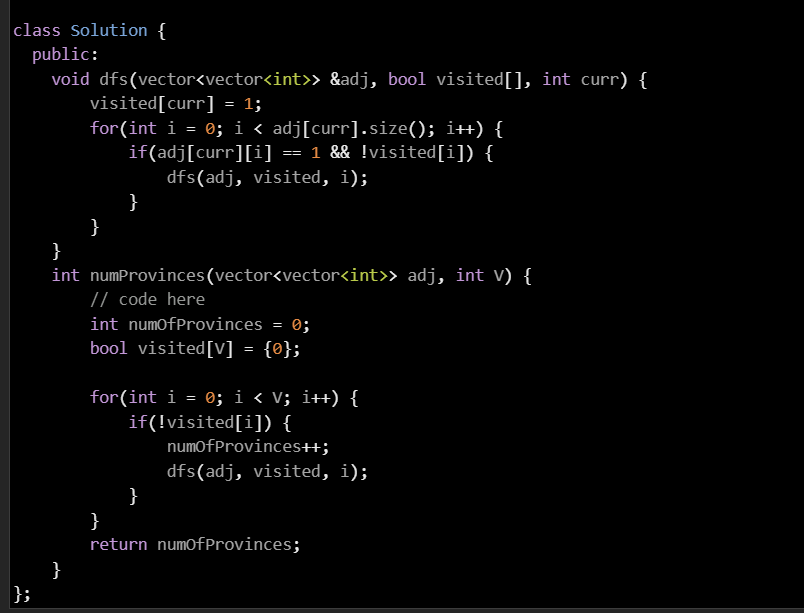

# Graph Algorithms

## Theory part

1. Graph Representation

   a. [Adjancency Matrix](./GraphRepresentationAdjacencyMatrix.cpp)

   b. [Adjacency List](./GraphRepresentationAdjacencyList.cpp)

   c. [Weighted Graph Representation](./WeightedGraphRepresentation.cpp)

2. Traversal

   a. [BFS Traversal](./BFSTraversal.cpp)

   b. [DFS Traversal](./DFSTraversal.cpp)


3. Detecting Cycle In Graph

    1. Undirected Graph

        a. [Problem Link](https://www.geeksforgeeks.org/problems/detect-cycle-in-an-undirected-graph/1?utm_source=youtube&utm_medium=collab_striver_ytdescription&utm_campaign=detect-cycle-in-an-undirected-graph)

        b. [Solution using BFS and DFS](./DetectCycleInGraph.cpp)
        
    2. Directed Graph

3. Strongly Connected Components

    a. [Kosraju's Algorithm - Link](https://www.geeksforgeeks.org/problems/strongly-connected-components-kosarajus-algo/1?utm_source=youtube&utm_medium=collab_striver_ytdescription&utm_campaign=strongly-connected-components-kosarajus-algo)

    b. [Kosaraju's Algorithm - Solution](./Kosaraju'sAlgo.cpp)
## Practice Question

1. [Number of Provinces](https://www.geeksforgeeks.org/problems/number-of-provinces/1?utm_source=youtube&utm_medium=collab_striver_ytdescription&utm_campaign=number_of_provinces) - GFG

   solution :

   

2. [Flood Fill Alogrithm](https://www.geeksforgeeks.org/problems/flood-fill-algorithm1856/1?utm_source=youtube&utm_medium=collab_striver_ytdescription&utm_campaign=flood-fill-algorithm)

   Solution(BFS):
   

   Solution(DFS):
   

3. [Rotten Oranges - GFG](https://www.geeksforgeeks.org/problems/rotten-oranges2536/1)

   [Rotting Oranges - LeetCode](https://leetcode.com/problems/rotting-oranges/)

   Solution:

```
    #define loop(i, n) for(int i = 0; i < n; i++)

class Solution  {
    public:
    //Function to find minimum time required to rot all oranges.
    int orangesRotting(vector<vector<int>>& grid) {
        // Code here
        int n = grid.size(), m = grid[0].size();

        queue<pair<int, int>> q;

        int total = 0;
        loop(i, n) {
            loop(j, m) {
                if(grid[i][j] == 2) {
                    q.push({i, j});
                }

                if(grid[i][j] != 0) {
                    total++;
                }
            }
        }

        if(q.size() == n * m) {
            return 0;
        }

        int reqTime = 0, rottenOranges = 0;

        int dx[] = {-1, 1, 0, 0};
        int dy[] = {0, 0, -1, 1};

        while(!q.empty()) {
            int currRottenOrange = q.size();
            rottenOranges += currRottenOrange;

            while(currRottenOrange--) {
                int x = q.front().first;
                int y = q.front().second;
                q.pop();

                loop(i, 4) {
                    int nx = x + dx[i], ny = y + dy[i];
                    if(nx >= 0 && nx < n && ny >= 0 && ny < m && grid[nx][ny] == 1) {
                        grid[nx][ny] = 2;
                        q.push({nx, ny});
                    }
                }
            }
            if(!q.empty())
                reqTime++;
        }


        if(total == rottenOranges) {
            return reqTime;
        }
        return -1;
    }
};
```
