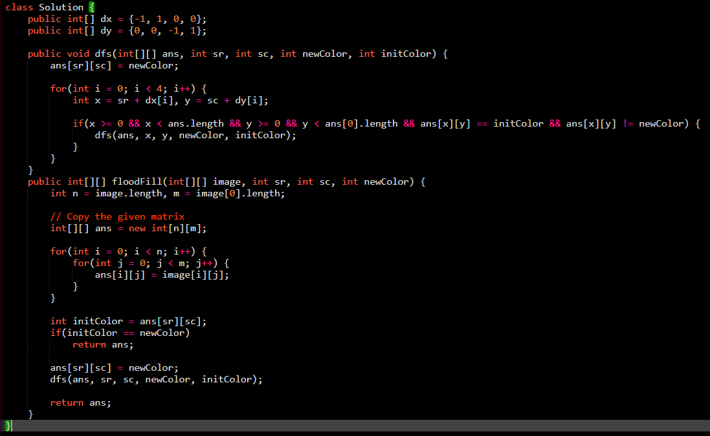

# Graph Algorithms

## Theory part

1. Graph Representation

   a. [Adjancency Matrix](./GraphRepresentationAdjacencyMatrix.cpp)

   b. [Adjacency List](./GraphRepresentationAdjacencyList.cpp)

   c. [Weighted Graph Representation](./WeightedGraphRepresentation.cpp)

2. Traversal

   a. [BFS Traversal](./BFSTraversal.cpp)

   b. [DFS Traversal](./DFSTraversal.cpp)


3. Detecting Cycle In Graph

    1. Undirected Graph

        a. [Problem Link](https://www.geeksforgeeks.org/problems/detect-cycle-in-an-undirected-graph/1?utm_source=youtube&utm_medium=collab_striver_ytdescription&utm_campaign=detect-cycle-in-an-undirected-graph)

        b. [Solution using BFS and DFS](./DetectCycleInGraph.cpp)
        
    2. Directed Graph

4. Topological Sort

    - [GFG - Link](https://www.geeksforgeeks.org/problems/topological-sort/1?utm_source=youtube&utm_medium=collab_striver_ytdescription&utm_campaign=topological-sort)
    
    - [Solution - BFS](./TopologicalSortBFS.cpp)
    - [Solution - DFS](./TopologicalSortDFS.cpp)

4. Shortest Path

    a. Shortest Path in Directed Acyclic Graph
    
    - [GFG link for practice](https://www.geeksforgeeks.org/problems/shortest-path-in-undirected-graph/0)
    - [Solution - DFS](./ShortestPath/DFSOnDAG.cpp)

    b. Shortest Path in Undirected Graph

    - [GFG link for practice](https://www.geeksforgeeks.org/problems/shortest-path-in-undirected-graph/0)
    - [Solution - BFS](./ShortestPath/BFSOnUndirectedGraph.cpp)

    c. Djikstra's Algorithm

    - [GFG link for practice](https://www.geeksforgeeks.org/problems/implementing-dijkstra-set-1-adjacency-matrix/1?utm_source=youtube&utm_medium=collab_striver_ytdescription&utm_campaign=implementing-dijkstra-set-1-adjacency-matrix)
    - [Solution - Using Min-Heap](./ShortestPath/DjikstraAlgoPQ.cpp)
3. Strongly Connected Components

    a. [Kosaraju's Algorithm - Link](https://www.geeksforgeeks.org/problems/strongly-connected-components-kosarajus-algo/1?utm_source=youtube&utm_medium=collab_striver_ytdescription&utm_campaign=strongly-connected-components-kosarajus-algo)

    b. [Kosaraju's Algorithm - Solution](./Kosaraju'sAlgo.cpp)

## Practice Question

1. [Number of Provinces](https://www.geeksforgeeks.org/problems/number-of-provinces/1?utm_source=youtube&utm_medium=collab_striver_ytdescription&utm_campaign=number_of_provinces) - GFG

   solution :

   

2. [Flood Fill Alogrithm](https://www.geeksforgeeks.org/problems/flood-fill-algorithm1856/1?utm_source=youtube&utm_medium=collab_striver_ytdescription&utm_campaign=flood-fill-algorithm)

   Solution(BFS):
   

   Solution(DFS):
   

3. [Rotten Oranges - GFG](https://www.geeksforgeeks.org/problems/rotten-oranges2536/1)

   [Rotting Oranges - LeetCode](https://leetcode.com/problems/rotting-oranges/)

   Solution:

```
#define loop(i, n) for(int i = 0; i < n; i++)

class Solution  {
    public:
    //Function to find minimum time required to rot all oranges.
    int orangesRotting(vector<vector<int>>& grid) {
        // Code here
        int n = grid.size(), m = grid[0].size();

        queue<pair<int, int>> q;

        int total = 0;
        loop(i, n) {
            loop(j, m) {
                if(grid[i][j] == 2) {
                    q.push({i, j});
                }

                if(grid[i][j] != 0) {
                    total++;
                }
            }
        }

        if(q.size() == n * m) {
            return 0;
        }

        int reqTime = 0, rottenOranges = 0;

        int dx[] = {-1, 1, 0, 0};
        int dy[] = {0, 0, -1, 1};

        while(!q.empty()) {
            int currRottenOrange = q.size();
            rottenOranges += currRottenOrange;

            while(currRottenOrange--) {
                int x = q.front().first;
                int y = q.front().second;
                q.pop();

                loop(i, 4) {
                    int nx = x + dx[i], ny = y + dy[i];
                    if(nx >= 0 && nx < n && ny >= 0 && ny < m && grid[nx][ny] == 1) {
                        grid[nx][ny] = 2;
                        q.push({nx, ny});
                    }
                }
            }
            if(!q.empty())
                reqTime++;
        }


        if(total == rottenOranges) {
            return reqTime;
        }
        return -1;
    }
};
```

4. Distance of nearest cell having 1/0

    - [Leetcode - 01 Matrix](https://leetcode.com/problems/01-matrix/description/)
    - [GFG - Distance of nearest cell having 1](https://www.geeksforgeeks.org/problems/distance-of-nearest-cell-having-1-1587115620/1?utm_source=youtube&utm_medium=collab_striver_ytdescription&utm_campaign=distance-of-nearest-cell-having-1)

    Solutions:
    <details>
            <summary>Leetcode</summary>

    ```
    #define loop(i, n) for(int i = 0; i < n; i++)

    class Solution {
    public:
        vector<vector<int>> updateMatrix(vector<vector<int>>& mat) {
            int n = mat.size(), m = mat[0].size();
            int dx[] = {-1, +1, 0, 0};
            int dy[] = {0, 0, -1, +1};

            vector<vector<int>> ans(n, vector<int>(m));
            vector<vector<bool>> visited(n, vector<bool>(m));

            queue<pair<pair<int, int>, int>> q;

            loop(i, n) {
                loop(j, m) {
                    if(mat[i][j] == 0) {
                        visited[i][j] = 1;
                        q.push(make_pair(make_pair(i, j), 0));
                    }
                }
            }

            while(!q.empty()) {
                int x = q.front().first.first, y = q.front().first.second;
                int minDistance = q.front().second;
                q.pop();
                ans[x][y] = minDistance;

                loop(k, 4) {
                    int nx = x + dx[k], ny = y + dy[k];
                    if(nx >= 0 && nx < n && ny >= 0 && ny < m && visited[nx][ny] == 0) {
                        visited[nx][ny] = 1;
                        q.push(make_pair(make_pair(nx, ny), minDistance + 1));
                    }
                }
            }
            return ans;
        }
    };
    ```
    </details>

    <details>
    <summary>GFG</summary>

    ```
    #define loop(i, n) for(int i = 0; i < n; i++)

    class Solution {
    public:
        // Function to find distance of nearest 1 in the grid for each cell.
        vector<vector<int>> nearest(vector<vector<int>>& grid) {
            // Code here
            int dx[] = {-1, 1, 0, 0};
            int dy[] = {0, 0, -1, 1};
            
            int n = grid.size(), m = grid[0].size();
            vector<vector<int>> ans(n, vector<int> (m));
            
            loop(i, n) {
                loop(j, m) {
                    if(grid[i][j] == 1) {
                        ans[i][j] = 0;
                    } else {
                        queue<pair<int, int>> q;
                        q.push({i, j});
                        
                        while(!q.empty()) {
                            int x = q.front().first, y = q.front().second;
                            q.pop();
                            bool chk = 0;
                            loop(k, 4) {
                                int nx = x + dx[k], ny = y + dy[k];
                                
                                if(nx >= 0 && nx < n && ny >= 0 && ny < m) {
                                    if(grid[nx][ny] == 1) {
                                        ans[i][j] = abs(i - nx) + abs(j - ny);
                                        chk = 1;
                                        break;
                                    } else {
                                        q.push({nx, ny});
                                    }
                                }
                            }
                            if(chk)
                                break;
                        }
                    }
                }
            }
            return ans;
        }
    };
    ```

    </details>

5. Surrounded Regions/Replace O's with X's

    - [LeetCode](https://leetcode.com/problems/surrounded-regions/description/)
    - [GFG](https://www.geeksforgeeks.org/problems/replace-os-with-xs0052/1?utm_source=youtube&utm_medium=collab_striver_ytdescription&utm_campaign=replace-os-with-xs)

    Solutions:

    <details>
    <summary>BFS</summary>

    ```
    #define loop(i, n) for(int i = 0; i < n; i++)
    auto init = []() { ios::sync_with_stdio(0);cin.tie(0);cout.tie(0);return 'c'; }();

    class Solution {
    public:
        void solve(vector<vector<char>>& board) {
            int n = board.size(), m = board[0].size();
            vector<vector<bool>> visited(n, vector<bool>(m));
            queue<pair<int, int>> q;

            loop(i, m) {
                if(board[0][i] == 'O' && !visited[0][i]) {
                    visited[0][i] = 1;
                    q.push({0, i});
                }
            }
            loop(i, m) {
                if(board[n - 1][i] == 'O' && !visited[n - 1][i]) {
                    visited[n - 1][i] = 1;
                    q.push({n - 1, i});
                }
            }

            loop(i, n) {
                if(board[i][0] == 'O' && !visited[i][0]) {
                    visited[i][0] = 1;
                    q.push({i, 0});
                }
            }

            loop(i, n) {
                if(board[i][m - 1] == 'O' && !visited[i][m - 1]) {
                    visited[i][m - 1] = 1;
                    q.push({i, m - 1});
                }
            }

            int dx[] = {-1, 0, +1, 0};
            int dy[] = {0, -1, 0, +1};

            while(!q.empty()) {
                int x = q.front().first, y = q.front().second;
                q.pop();
                visited[x][y] = 1;

                loop(k, 4) {
                    int nx = x + dx[k], ny = y + dy[k];
                    if(nx >= 0 && nx < n && ny >= 0 && ny < m && board[nx][ny] == 'O' && visited[nx][ny] == 0) {
                        visited[nx][ny] = 1;
                        q.push(make_pair(nx, ny));
                    }
                }
            }

            loop(i, n) {
                loop(j, m) {
                    if(visited[i][j] == 0 && board[i][j] == 'O') {
                        board[i][j] = 'X';
                    }
                }   
            }
        }
    };
    ```
    </details>


    <details>
    <summary>DFS Approach</summary>

    ```
    #define loop(i, n) for(int i = 0; i < n; i++)

        int dx[4] = {-1, 1, 0, 0};
        int dy[4] = {0, 0, -1, 1};

    class Solution {
    public:
        void dfs(int x, int y, vector<vector<bool>> &visited, vector<vector<char>> &mat) {
            visited[x][y] = 1;
            loop(k, 4) {
                int nx = x + dx[k], ny = y + dy[k];
                if(nx >= 0 && nx < mat.size() && ny >= 0 && ny < mat[0].size() && mat[nx][ny] == 'O' && !visited[nx][ny]) {
                    visited[x][y] = 1;
                    dfs(nx, ny, visited, mat);
                }
            }
        }
        vector<vector<char>> fill(int n, int m, vector<vector<char>> mat) {
            // copy original matrix
            vector<vector<char>> ans(n, vector<char>(m));
            loop(i, n) {
                loop(j, m) {
                    ans[i][j] = mat[i][j];
                }
            }
            
            vector<vector<bool>> visited(n, vector<bool>(m));   
            
            loop(i, m) {
                if(ans[0][i] == 'O' && !visited[0][i]) {
                    dfs(0, i, visited, ans);
                }
            }
            
            loop(i, m) {
                if(ans[n - 1][i] == 'O' && !visited[n - 1][i]) {
                    dfs(n - 1, i, visited, ans);
                }
            }
            loop(i, n) {
                if(ans[i][0] == 'O' && !visited[i][0]) {
                    dfs(i, 0, visited, ans);
                }
            }
            
            loop(i, n) {
                if(ans[i][m - 1] == 'O' && !visited[i][m - 1]) {
                    dfs(i, m - 1, visited, ans);
                }
            }
            
            loop(i, n) {
                loop(j, m) {
                    if(ans[i][j] == 'O' && !visited[i][j]) {
                        ans[i][j] = 'X';
                    }
                }
            }
            return ans;
        }
    };
    ```
    </details>